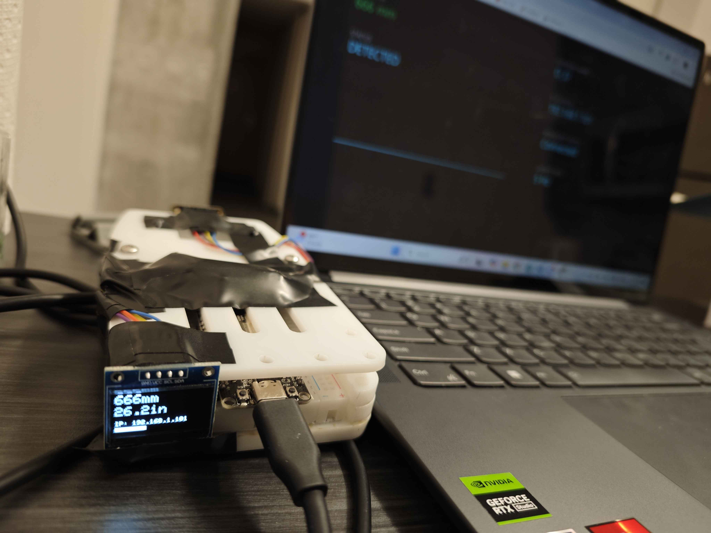
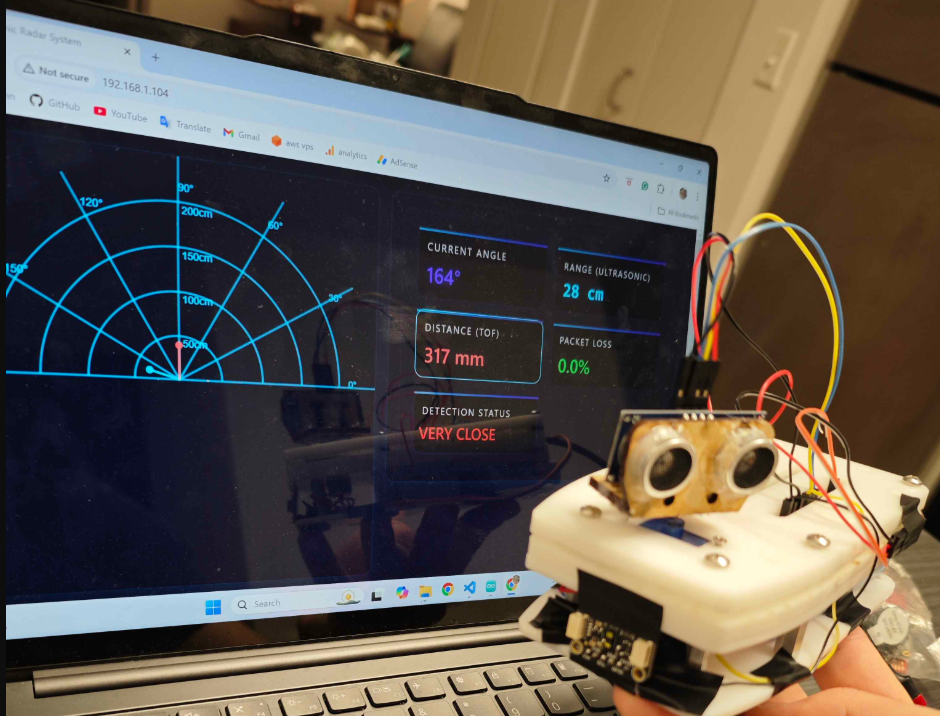
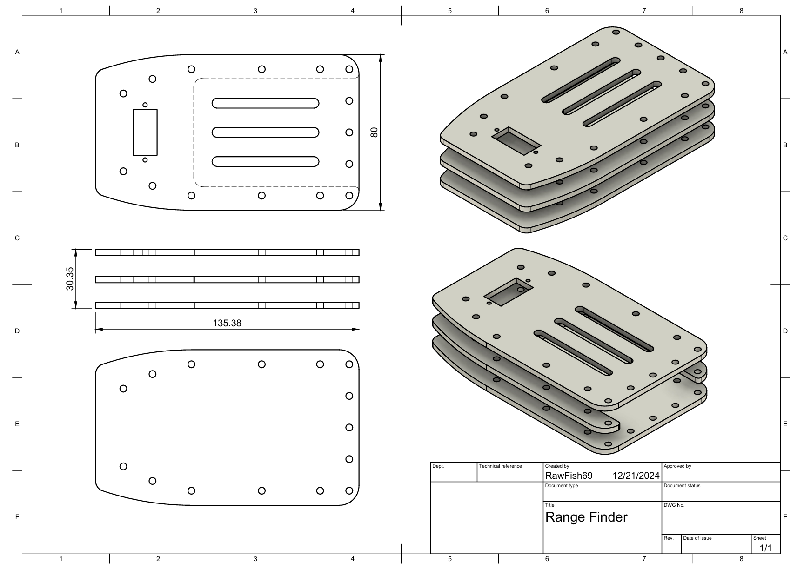

# ESP32-Range-Finder

## Requirements
- ESP32 or ESP8266 Board
- VL53L1X sensor
- HC-SR04 ultrasonic sensor (Hybrid only)
- Servo motor for scanning (Hybrid only)
- OLED (Optional)
- Arduino IDE or PlatformIO

## Installation
1. Clone or download this repository.
2. Open the project in your preferred IDE.
3. Install required libraries (Adafruit_VL53L1X, ArduinoJson, etc.).

## Usage
1. Select the .ino you would like to use, upload the code to the ESP32.  
2. Connect to the “Range Finder Beta” Wi-Fi (for Hybrid Mode), "O_O" WiFi (for ranger finder ONLY mode)
3. Visit http://192.168.1.101 in a browser to view the radar UI and stats.

## Images

*ESP8266 Range Finder TOF Mode*

*ESP32 Range Finder Hybrid Mode*

## CAD Files

*2D drawing of the range finder holder*
### [3D model of the range finder holder](CAD/range_finder_model.stl)

## Circuit Diagrams
TODO
